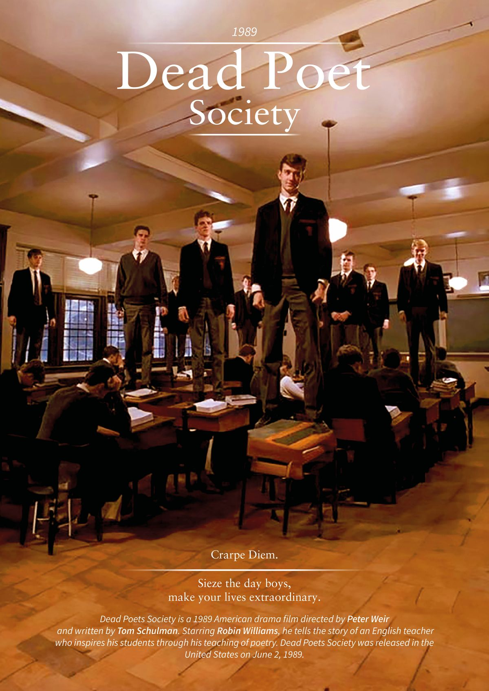

# 🌐 MovieVerse: My First Independent HTML & CSS Movie Review Blog! 🎥

Hey there! Over the past few weeks, I've been diving deeper into the fundamentals of HTML and CSS. To solidify what I've learned, I built **MovieVerse**—a simple, fully static movie review blog—from scratch, without any frameworks or JavaScript. This is my **first solo frontend project**, separate from any university group work, and it gave me hands-on experience turning ideas into a real, browsable website.

  
*(Screenshot of the home page hero section with movie cards)*

## 🚀 Live Demo
Check it out live here: [MovieVerse Demo](https://your-username.github.io/movieverse) *(Replace with your actual GitHub Pages link once deployed)*

## ✨ Key Features
- **Multi-Page Structure**: Home (blog index), detailed review page (e.g., *Dead Poets Society*), About, and Contact pages.
- **Responsive Layout**: 
  - Grid-based movie card gallery on the home page.
  - Flexbox-powered two-column design on review pages (poster/sidebar + review text).
- **Embedded Media**: YouTube trailer iframe integrated into the review page.
- **Clean UI/UX**:
  - Consistent dark theme with Poppins font.
  - Sticky navigation bar with active page highlighting.
  - Hover effects on cards, links, and social icons.
  - Form styling on the Contact page (pure CSS, no functionality yet).
- **Icons & Externals**: Font Awesome for social media icons.
- **Footer**: Copyright notice and social links on every page.

## 🛠️ Technologies Used
- **HTML5**: Semantic structure, forms, iframes, and navigation.
- **CSS3**: 
  - Flexbox & CSS Grid for layouts.
  - Custom properties aren't used, but consistent color palette (`#0f172a` background, `#38bdf8` accents).
  - Media queries implied via flexible units (responsive by default).
  - Transitions and transforms for interactive hover states.

No JavaScript, no backend—just pure frontend fundamentals!

## 📂 Project Structure

movieverse/
├── index.html          # Home page with movie cards & "Coming Soon" section
├── dpsReview.html      # Detailed review for Dead Poets Society
├── About.html          # About page
├── contacts.html       # Contact form page
├── style.css           # Global stylesheet
├── images/             # Movie posters (deadPoets-Society.jpg, TheTerminal.jpg, etc.)
└── README.md           # This file

## 🎨 What I Learned & Improved
This project was all about **strengthening the basics**:
- **HTML Semantics**: Proper use of `<header>`, `<nav>`, `<main>`, `<section>`, `<article>`, and `<footer>`.
- **CSS Layouts**: Mastering Flexbox for side-by-side columns and Grid for responsive card galleries.
- **Styling Organization**: Consistent spacing, color variables (via repeated hex codes), and reusable classes.
- **UI Decisions**: Choosing a dark mode theme for a cinematic feel, accent colors for CTAs, and subtle animations.
- **End-to-End Workflow**: From wireframing in my head to coding, testing responsiveness, and debugging cross-page links.
- **Confidence Boost**: Proved I can build something functional and visually appealing **independently**.

It also highlighted areas for growth—like adding real form submission (future JS!) or more reviews.

## 🔮 Future Ideas
- Add JavaScript for form validation and dynamic review loading.
- Expand with more movie reviews and a search/filter feature.
- Make it fully responsive with explicit media queries for mobile.
- Host on GitHub Pages and add a custom domain.

## 🙌 Acknowledgments
- Movie data and posters sourced from public domains (IMDb-inspired).
- Font Awesome for icons.
- Inspiration from classic films that remind us to *"seize the day!"*

---

